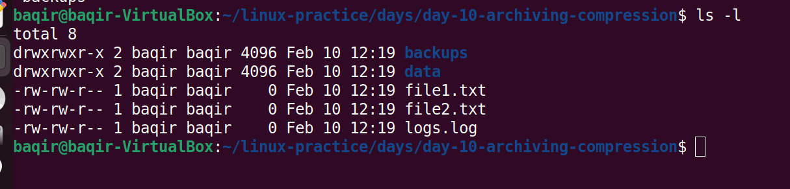
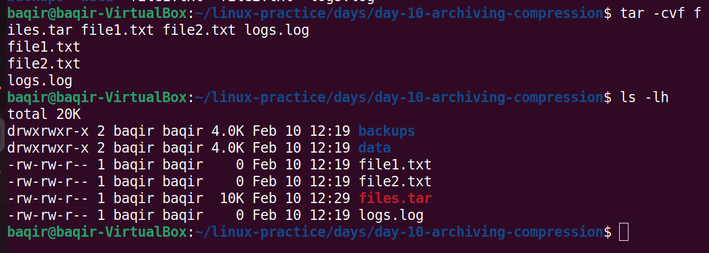
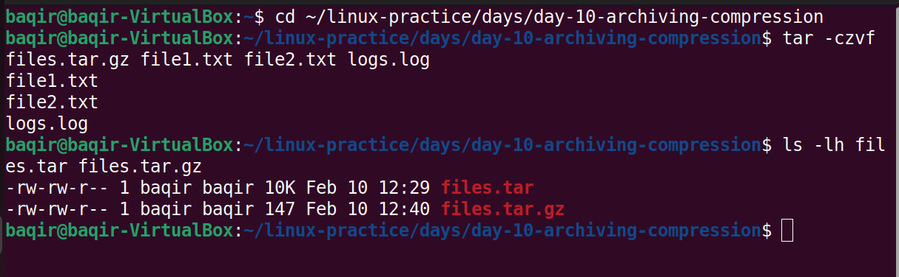
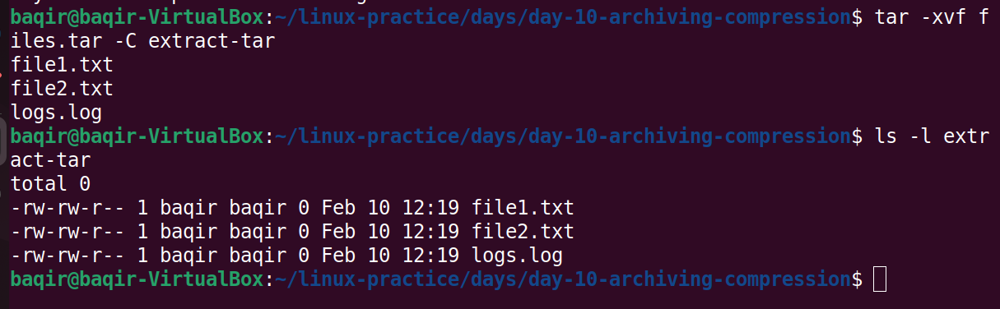
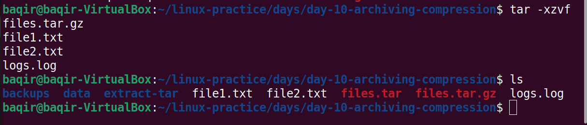
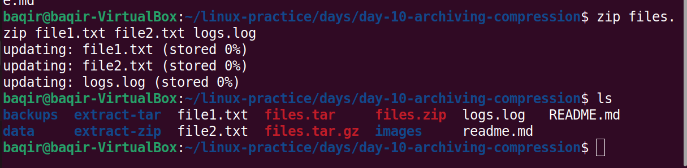
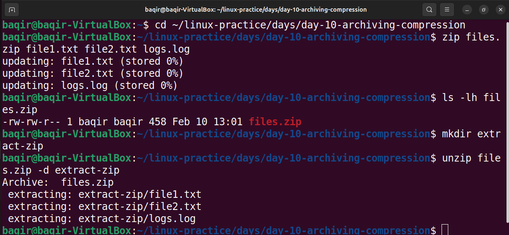

## 📦 Day 10: Archiving & Compression in Linux
## 📌 Objective
Learn how to archive and compress files using tar, gzip, and zip, and how to extract them properly.
### 📁 Directory Structure
```text

day-10-archiving-compression/
├── file1.txt
├── file2.txt
├── logs.log
├── files.tar
├── files.tar.gz
├── files.zip
├── extract-tar/
├── extract-zip/
├── images/
│ ├── day10-files-structure.png
│ ├── day10-tar-created.png
│ ├── day10-targz-created.png
│ ├── day10-tar-extract.png
│ ├── day10-extract-tar-gz.png
│ ├── day10-zipfile-created.png
│ └── day10-zip-extract.png
└── README.md
```
## 🟢 Step 1: Initial Files Structure
Created sample files for archiving practice.

```Bash
ls
```
## 📸 Screenshot:



## 🟢 Step 2: Create TAR Archive
Created a .tar archive using tar.

```Bash
tar -cvf files.tar file1.txt file2.txt logs.log
```
## 📸 Screenshot:



## 🟢 Step 3: Create TAR.GZ (Compressed TAR)
Compressed the tar file using gzip.

```Bash
tar -czvf files.tar.gz file1.txt file2.txt logs.log
```
## 📸 Screenshot:



## 🟢 Step 4: Extract TAR Archive
Extracted .tar file into a directory.

```Bash
mkdir extract-tar
tar -xvf files.tar -C extract-tar
```
## 📸 Screenshot:



## 🟢 Step 5: Extract TAR.GZ Archive
Extracted compressed tar archive.

```Bash
tar -xzvf files.tar.gz -C extract-tar
```
## 📸 Screenshot:



## 🟢 Step 6: Create ZIP Archive
Created a zip archive.

```Bash
zip files.zip file1.txt file2.txt logs.log
```
## 📸 Screenshot:



## 🟢 Step 7: Extract ZIP Archive
Extracted zip file into a directory.

```Bash
mkdir extract-zip
unzip files.zip -d extract-zip
```
## 📸 Screenshot:



###  📘 Commands Summary

## Create tar archive
tar -cvf files.tar file1.txt file2.txt logs.log

## Create tar.gz archive
tar -czvf files.tar.gz file1.txt file2.txt logs.log

## Extract tar
tar -xvf files.tar

## Extract tar.gz
tar -xzvf files.tar.gz

## Create zip archive
zip files.zip file1.txt file2.txt logs.log

## Extract zip
unzip files.zip

## ✅ Learning Outcome

Understood difference between archive vs compression
Practiced tar, gzip, and zip
Learned safe extraction with directories
Improved real-world Linux file handling skills
## 🏁 Status
✔ Day 10 completed
