# 📡 Day 11 — Linux Networking Deep Dive & Apache Troubleshooting

> Hands-on networking analysis and real-world service troubleshooting simulation.

---

# 🧠 Step 1 — Inspect Network Interface

### Check Interface Details

```bash
ip addr
```

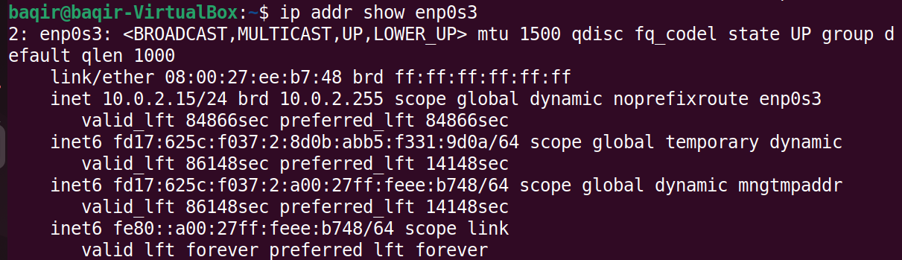

---

### Verify Assigned IP Address

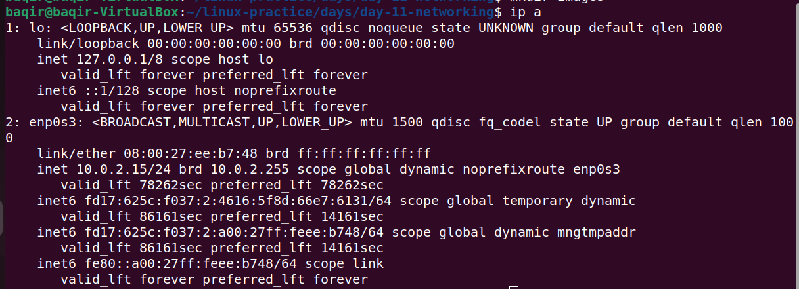

---

# 🌐 Step 2 — Routing & DNS Configuration

### Check Default Gateway

```bash
ip route
```

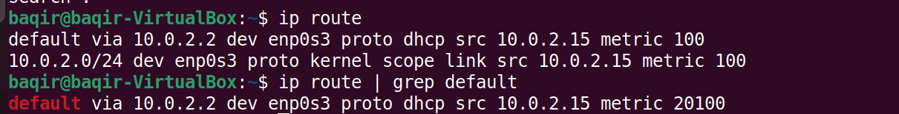

---

### View Routing Table

```bash
route -n
```

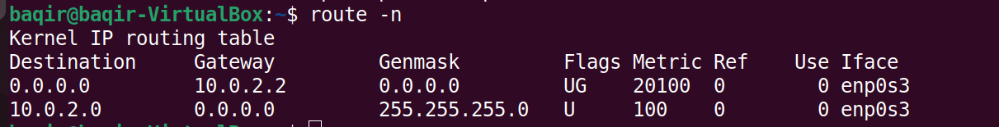

---

### Verify DNS Configuration

```bash
cat /etc/resolv.conf
```

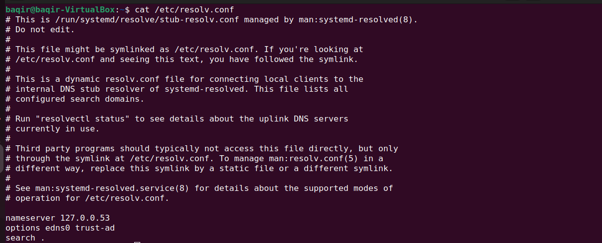

---

### Check DNS Status

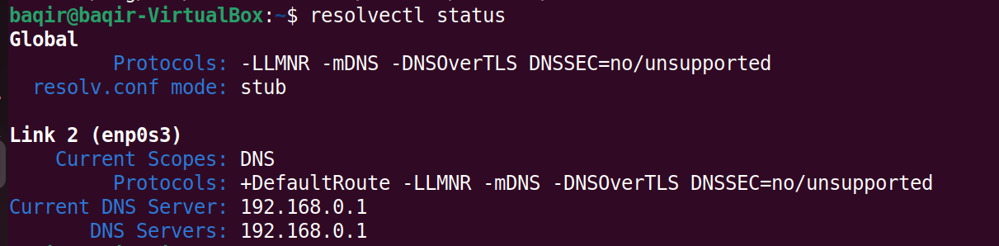

---

# 🌍 Step 3 — Connectivity Testing

### Ping External IP

```bash
ping 8.8.8.8
```

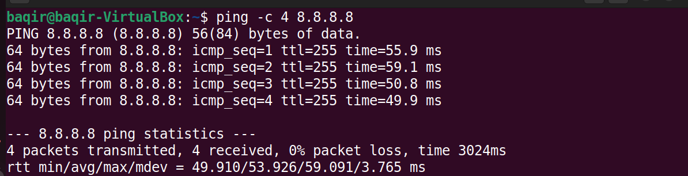

---

### Ping Domain Name

```bash
ping google.com
```

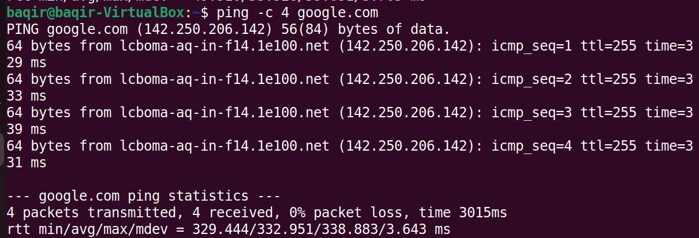

---

# 🔍 Step 4 — Inspect Open Ports

### Using ss

```bash
ss -tuln
```

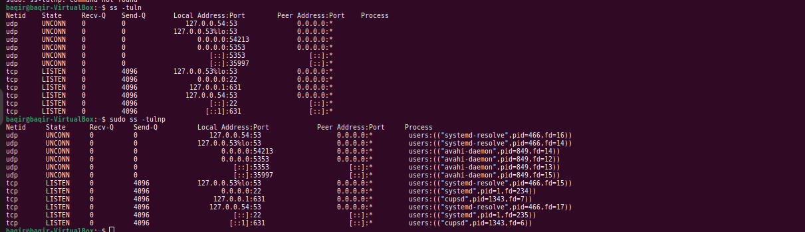

---

### Using netstat

```bash
netstat -tuln
```

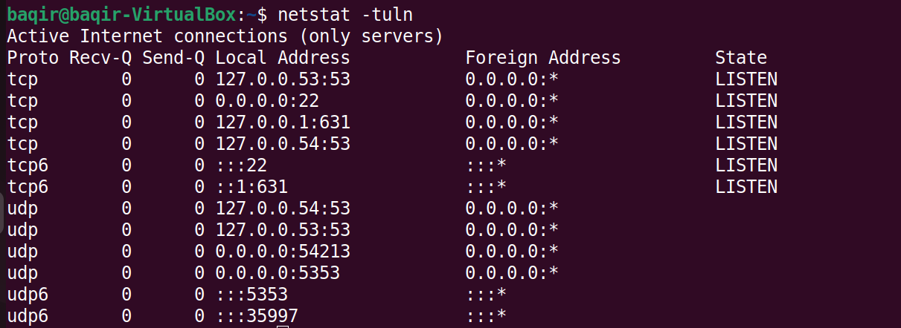

---

### Using lsof

```bash
lsof -i
```


---

# 🛰 Step 5 — Port Scanning with Netcat

### Netcat Installed

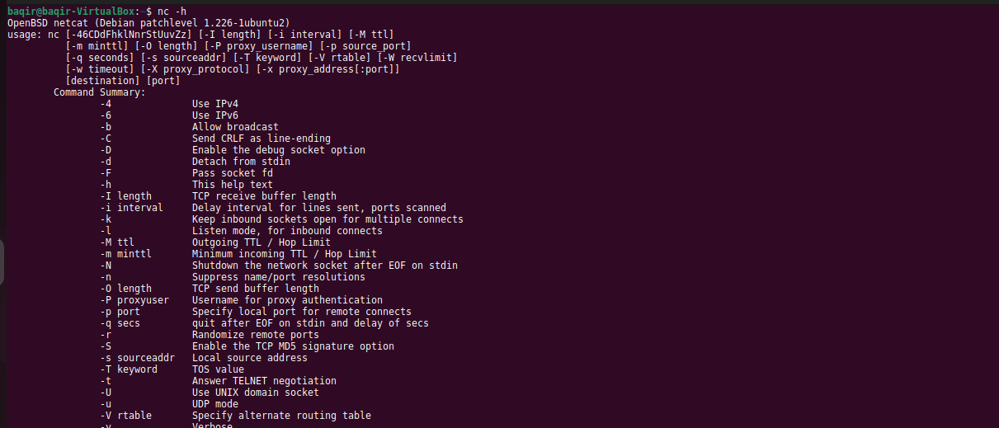

---

### Scan Localhost SSH Port

```bash
nc -zv localhost 22
```

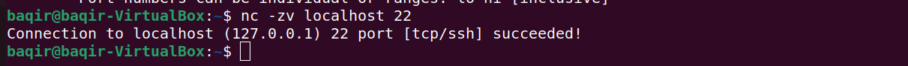

---

### Scan Google Port 80

```bash
nc -zv google.com 80
```

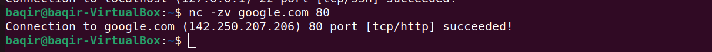

---

### Local Listener Test

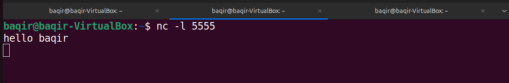

---

### Port Range Scan

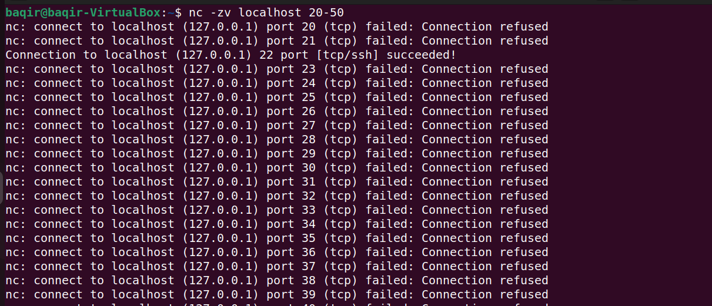

---

# 🚨 Step 6 — Real DevOps Troubleshooting Simulation

---

## 🔴 Stop Apache

```bash
sudo systemctl stop apache2
```

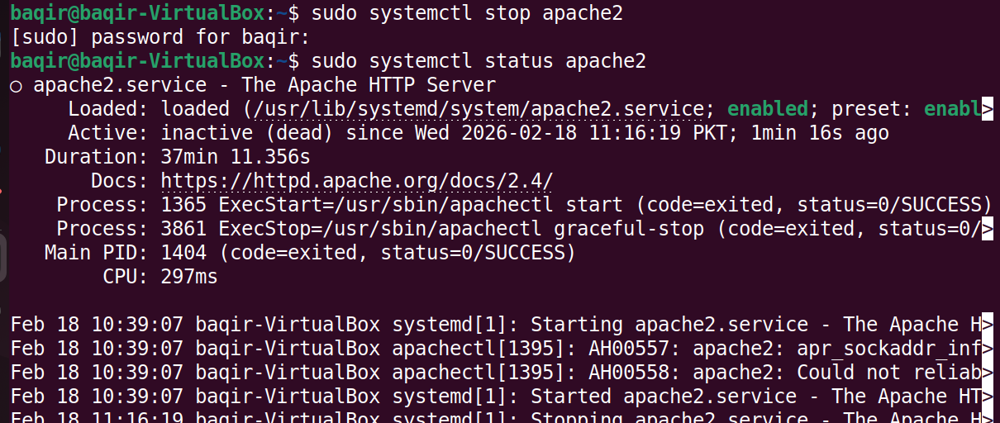

---

## 🔴 Port 80 Not Listening

```bash
ss -tuln | grep :80
```


---

## 🔴 Curl Fails

```bash
curl -I localhost
```

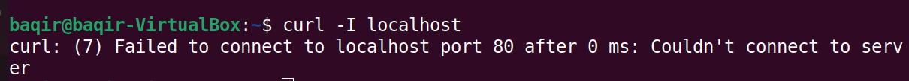

---

## 🟢 Start Apache

```bash
sudo systemctl start apache2
```


---

## 🟢 Apache Running


---

## 🟢 Port 80 Listening

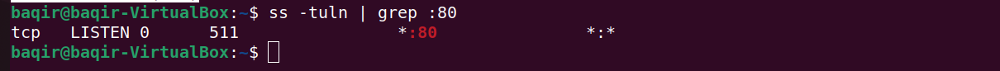

---

## 🟢 HTTP 200 OK

```bash
curl -I localhost
```

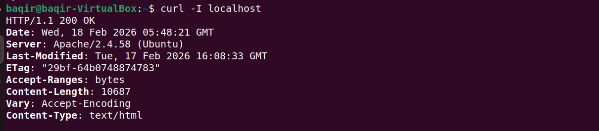

---

## 🟢 Page Verified


---

## 🔥 Skills Practiced

- Network Interface Inspection
- Routing Table Analysis
- DNS Configuration
- Connectivity Testing
- Port Monitoring
- Service Binding to Ports
- Netcat Scanning
- Apache Service Control
- HTTP Verification with curl
- End-to-End Troubleshooting Workflow

---

# 🛠 Tools Used

- ip
- route
- ping
- ss
- netstat
- lsof
- nc (Netcat)
- systemctl
- curl
- Apache2

---

# 🎯 Final Outcome

Simulated real production issue:

Service Down → Port Closed → HTTP Failed  
Service Restarted → Port Listening → HTTP 200 OK  

Complete troubleshooting lifecycle successfully executed.

---

# 🏁 Conclusion

This lab reflects practical DevOps troubleshooting:

✔ Root cause detection  
✔ Service management  
✔ Port verification  
✔ HTTP validation  
✔ Recovery confirmation  

Networking fundamentals + Service debugging completed.
