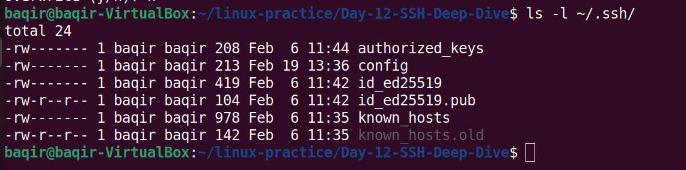
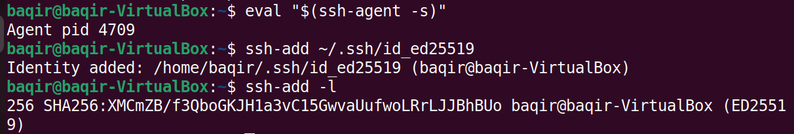
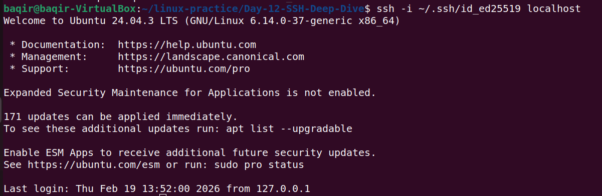
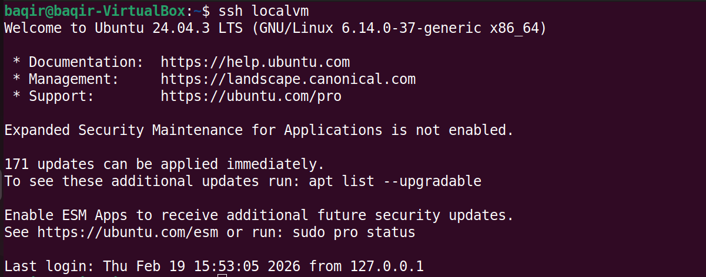
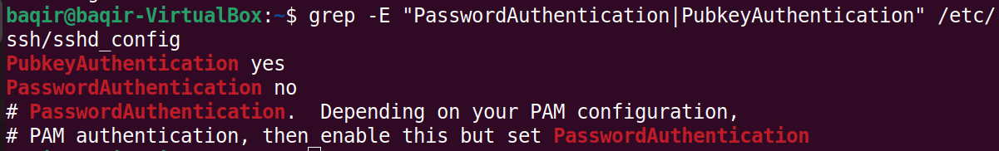
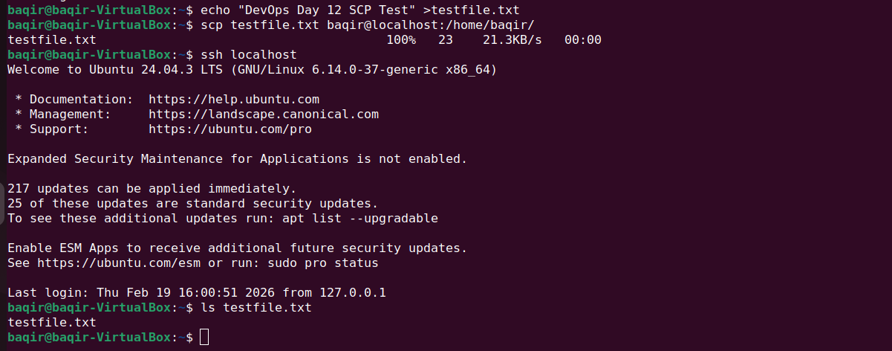
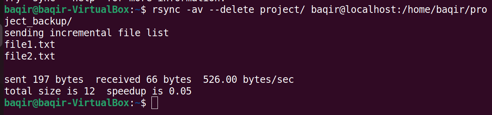
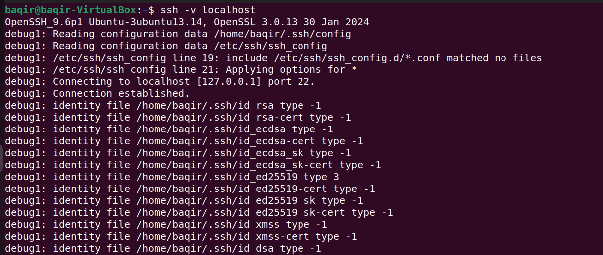

## Day 12 — SSH Deep Dive 🔐
## 📂 Folder Structure

```
Day-12-SSH-Deep-Dive/
│── README.md
│── images/
    ├── day12-existing-ssh-key.png

    ├── day12-ssh-agent-working.png

    ├── day12-key-based-login-success.png

    ├── day12-ssh-config-alias-success.png

    ├── day12-ssh-security-config.png

    ├── day12-scp-transfer-success.png

    ├── day12-rsync-sync-success.png

    └── day12-ssh-debug-success.png
```
## 📌 Objective
Master Secure Shell (SSH) in real DevOps style:
- SSH key generation
- Key-based authentication
- SSH agent usage
- SSH config aliasing
- SSH security hardening
- SCP file transfer
- Rsync synchronization
- SSH debugging

---

## 1️⃣ Existing SSH Key Verification

Checked existing SSH keys in `~/.ssh` directory.

```bash
ls -l ~/.ssh/
```
## 📸 Screenshot:

## 2️⃣ SSH Agent Setup

Started SSH agent and added private key.

```Bash
eval "$(ssh-agent -s)"
ssh-add ~/.ssh/id_ed25519
```
Verified loaded identity:

```Bash
ssh-add -l
```
## 📸 Screenshot:


## 3️⃣ Key-Based Login Test
Connected to localhost using SSH without password.

```Bash
ssh localhost
```
Successful login confirms key-based authentication.

## 📸 Screenshot:


## 4️⃣ SSH Config Alias Setup
Edited SSH config file:

```Bash
nano ~/.ssh/config
```
Added alias configuration:


Host localvm
    HostName localhost
    User baqir
    IdentityFile ~/.ssh/id_ed25519
Connected using alias:

```Bash
ssh localvm
```
## 📸 Screenshot:


## 5️⃣ SSH Security Hardening
Verified authentication settings:

```Bash
grep -E "PasswordAuthentication|PubkeyAuthentication" /etc/ssh/sshd_config
```
Confirmed:
PubkeyAuthentication yes
PasswordAuthentication no

## 📸 Screenshot:

## 6️⃣ SCP File Transfer
Transferred file securely using SCP:

```Bash
scp testfile.txt baqir@localhost:/home/baqir/
```
## 📸 Screenshot:

## 7️⃣ Rsync File Synchronization
Created project directory and backup.

```Bash
mkdir project
echo "file1" > project/file1.txt
echo "file2" > project/file2.txt
```
Synced project directory:

```Bash
rsync -av --delete project/ baqir@localhost:/home/baqir/project_backup/
```
## 📸 Screenshot:


## 8️⃣ SSH Debug Mode
Used verbose mode to troubleshoot connection.

```Bash
ssh -v localhost
```
Observed authentication flow and debug output.

## 📸 Screenshot:


## 🧠 What I Learned
• Difference between password and key-based authentication
• SSH agent purpose and workflow
• SSH alias configuration
• Secure SSH hardening practices
• SCP vs Rsync difference
• Using debug mode for troubleshooting
• Importance of case sensitivity in Linux paths
## 🚀 DevOps Relevance
SSH is core for:
• Server management
• CI/CD pipelines
• Cloud VM access
• Secure automation
• Production troubleshooting
• Day 12 strengthened real-world DevOps operational skills.
## ✅ Status
✔ Completed
✔ Tested
✔ Documented
✔ Production-relevant
## 🔥 Author
Muhammad Baqir Nawaz — DevOps Journey 🚀
