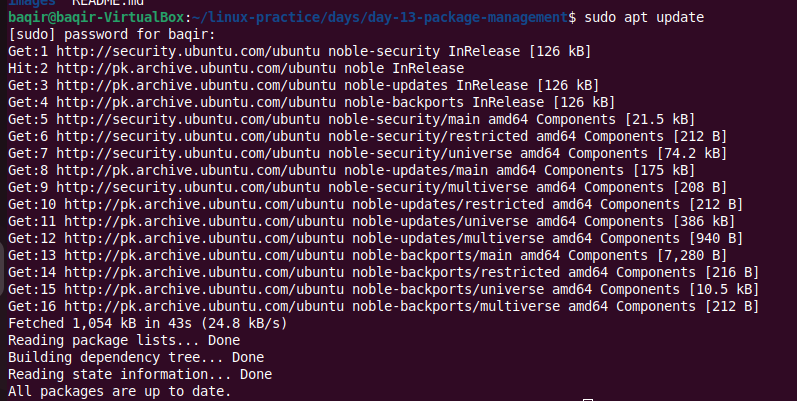
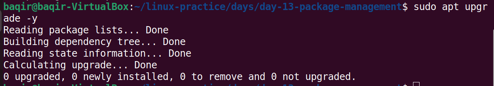
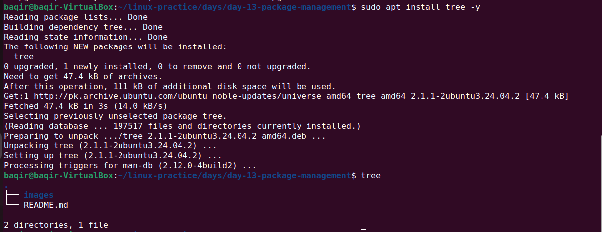
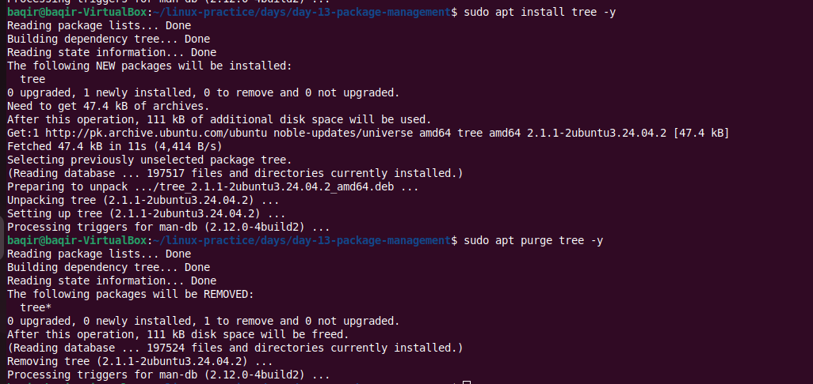
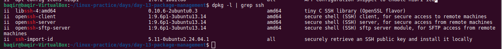
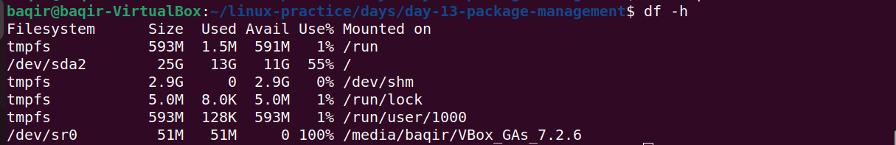

## 📦 Day 13 — Linux Package Management (APT & DPKG Deep Dive)
Hands-on package lifecycle management and system maintenance using APT & DPKG (Ubuntu 24.04).


## 🎯 Objective
Master Linux package management in real DevOps workflow:
● Update repositories
● Upgrade system packages
● Install & remove software
● Purge configurations
● Search & inspect packages
● Identify file ownership
● Clean unused dependencies
● Free disk space

---
## 📂 Folder Structure
```
day-13-package-management/
│── README.md
└── images/

    ├── day13-apt-update.png

    ├── day13-apt-upgrade.png

    ├── day13-install-tree.png

    ├── day13-remove-tree.png

    ├── day13-purge-tree.png

    ├── day13-search-ssh.png

    ├── day13-which-ssh.png

    ├── day13-dpkg-file-owner.png

    ├── day13-apt-autoremove.png

    ├── day13-apt-clean.png

    └── day13-disk-usage.png

```

---

## 1️⃣ Update Package Index
Refresh repository metadata.

```
sudo apt update

```
## 📸 Screenshot:



## 2️⃣ Upgrade Installed Packages
Upgrade installed packages to latest versions.

```
sudo apt upgrade

```
##📸 Screenshot:



## 3️⃣ Install a Package (tree)
Install the tree utility.

```
sudo apt install tree

```
## 📸 Screenshot:



## 4️⃣ Remove a Package
Remove installed package (keeps config files).

```
sudo apt remove tree

```
## 📸 Screenshot:


## 5️⃣ Purge a Package
Completely remove package including configuration files.

```
sudo apt purge tree

```
## 📸 Screenshot:



## 6️⃣ Search Installed SSH Packages
List SSH-related packages.

```
dpkg -l | grep ssh
apt list --installed | grep openssh

```
✔ ii in dpkg output = installed
✔ [installed,automatic] = dependency-installed

## 📸 Screenshot:



## 7️⃣ Locate SSH Binary
Find executable location.

```
which ssh

```
## 📸 Screenshot:


## 8️⃣ Identify File Ownership
Find which package owns a file.

```
dpkg -S /usr/bin/ssh

```
## 📸 Screenshot:


## 9️⃣ Remove Unused Dependencies
Clean orphaned packages.

```
sudo apt autoremove

```
## 📸 Screenshot:


## 🔟 Clean Package Cache
Remove cached .deb files.

```
sudo apt clean

```
## 📸 Screenshot:


## 1️⃣1️⃣ Check Disk Usage
Verify disk space after cleanup.

```
df -h

```
## 📸 Screenshot:



---

## 🧠 Key Concepts Learned

● Difference between remove and purge
● Role of APT vs DPKG
● How to inspect installed packages
● Dependency management
● Package lifecycle control
● System cleanup and maintenance
● File-to-package mapping

---

## 🔥 DevOps Relevance

Package management is critical in DevOps because:
● Servers require regular security updates
● CI/CD pipelines depend on system packages
● Containers use minimal base images
● Production servers must be cleaned regularly
● Debugging often requires identifying package ownership
● Automation scripts rely on predictable package states

This lab strengthens real-world operational skills for:
✔ Server provisioning
✔ Infrastructure automation
✔ Security patch management
✔ System troubleshooting
✔ Environment consistency

## 📊 Practical Workflow Simulated
Update → Upgrade → Install → Remove → Purge → Inspect → Clean → Verify Disk
Complete lifecycle of package management executed successfully.

## ✅ Status
✔ Completed
✔ Tested
✔ Documented
✔ Production-relevant

---

## 👨‍💻 Author
Muhammad Baqir Nawaz
DevOps Journey 🚀

---

## 📌 Summary 
Day 13 focused on mastering Linux package management using APT and DPKG.
Performed system updates, installed and removed packages, purged configurations, inspected SSH packages, identified file ownership, cleaned unused dependencies, and verified disk space.
Simulated real DevOps maintenance work flow Update repositories
Upgrade system packages
Install & remove software
Purge configurations
Search & inspect packages
Identify file ownership
Clean unused dependencies
Free disk space
