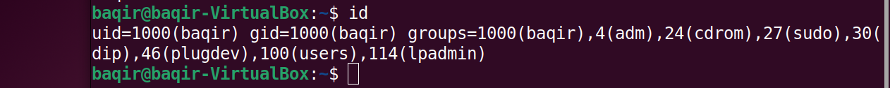
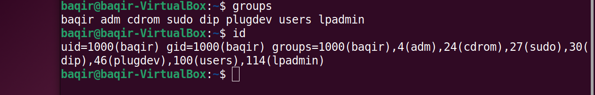
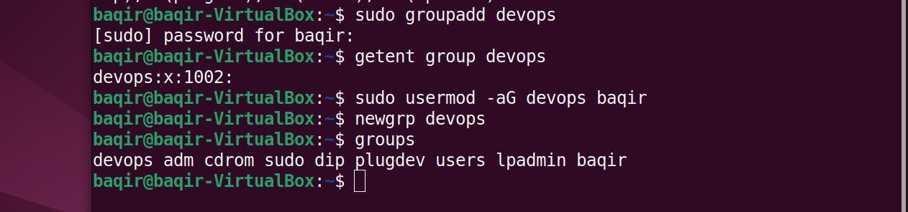
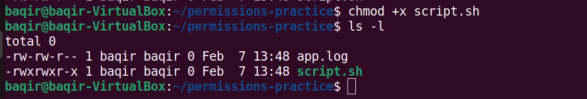
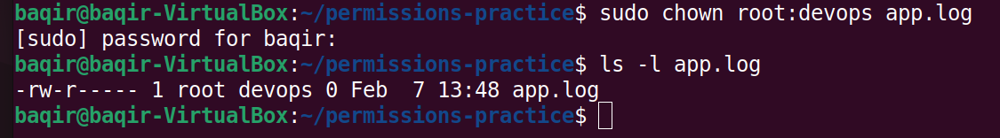
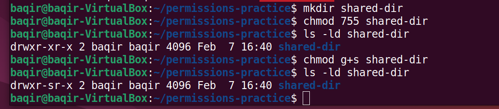
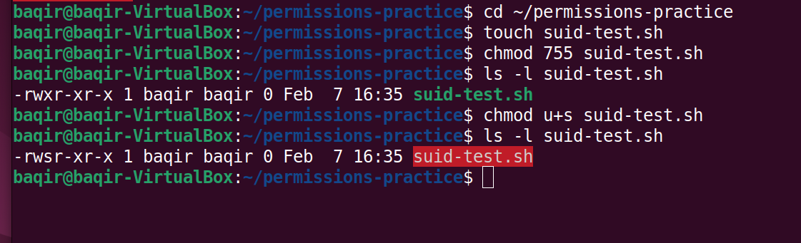
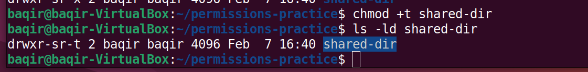
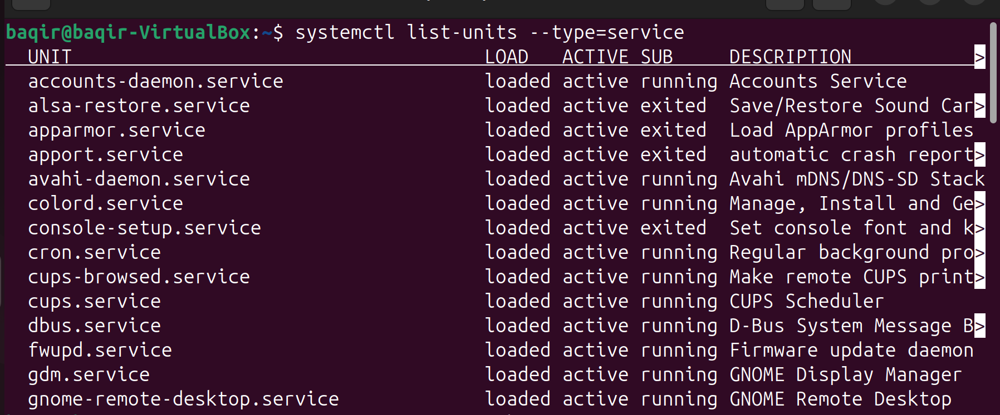

# Day 7 – Linux Users, Groups & Permissions (Very Important)
## 📸 Screenshots – Day 7 Practice
> Proof of hands-on practice covering users, groups, permissions, SGID, sticky bit, and shared DevOps directories.
### User & Identity

### Group Management

### File Permissions

### Ownership & Shared Directory

### Special Permissions

### System Context

## 🎯 Objective
Understand how Linux manages **users**, **groups**, and **permissions**, and practice real-world scenarios like **team-based access**, **SGID**, and **shared directories** used in DevOps environments.

---

## 🔹 Step 1: Identify Current User & Groups
Commands practiced:

whoami
id
groups
✔ Learned about:
UID (User ID)
GID (Group ID)
Primary vs Secondary groups

##🔹 Step 2: Create a New Group
Created a DevOps team group:

sudo groupadd devops-team
getent group devops-team
✔ Verified group creation successfully.
##🔹 Step 3: Add User to Group
Added current user to the DevOps team:

sudo usermod -aG devops-team baqir
newgrp devops-team
groups
✔ User is now part of devops-team.
##🔹 Step 4: SGID on Files & Directories
SGID on file:
chmod u+s suid-test.sh
ls -l suid-test.sh
SGID on directory:

mkdir shared-dir
chmod g+s shared-dir
ls -ld shared-dir
✔ Understood how SGID works on files vs directories.
##🔹 Step 5: Real-World Shared DevOps Directory
Created a shared DevOps directory:

sudo mkdir -p /srv/devops
sudo chown :devops-team /srv/devops
sudo chmod 2775 /srv/devops
ls -ld /srv/devops
✔ SGID ensures all files inherit the devops-team group.
##🔹 Step 6: Verify Group Inheritance

cd /srv/devops
touch test.txt
ls -l test.txt
✔ File automatically inherited group:

devops-team
🧠 Key Learnings
Linux permissions = security foundation
SGID is critical for team collaboration
/srv is commonly used for shared service data
Group ownership prevents permission conflicts

🌍 Real-World Use Case
Used in DevOps teams where:
Multiple engineers deploy files
CI/CD pipelines need shared access
Production directories must stay secure
✅ Day 7 Status
✔ Users
✔ Groups
✔ Permissions
✔ SGID
✔ Shared DevOps Directory
Day 7 completed successfully- hands-on verify 🚀
