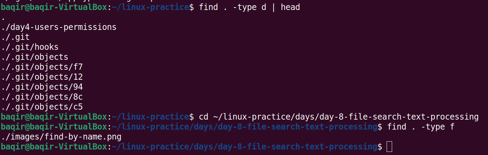
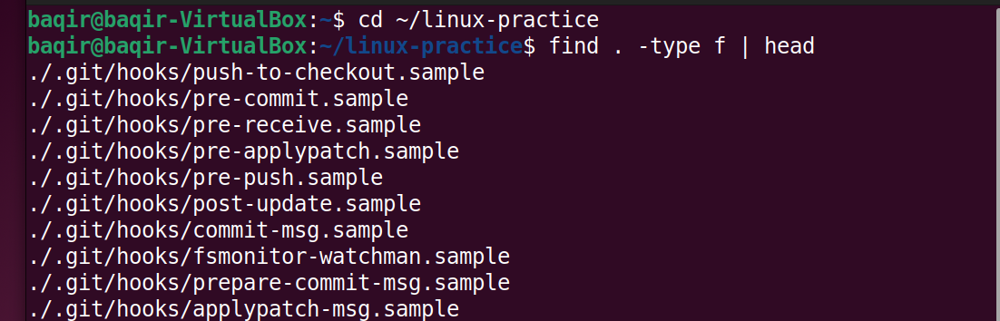
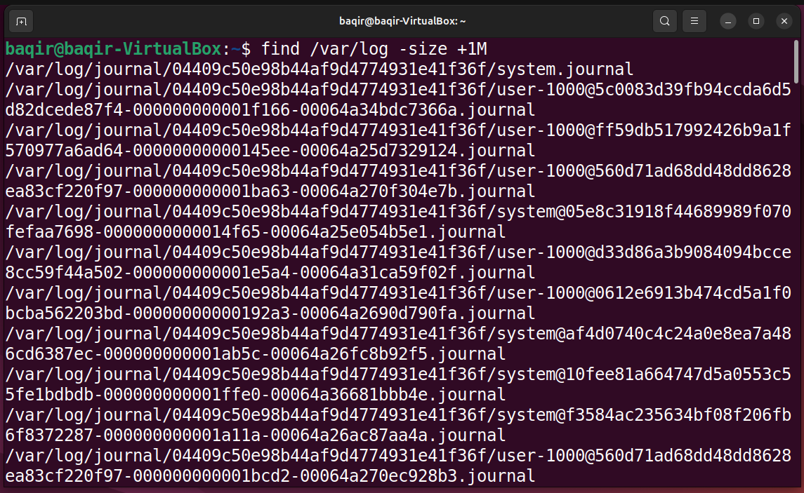
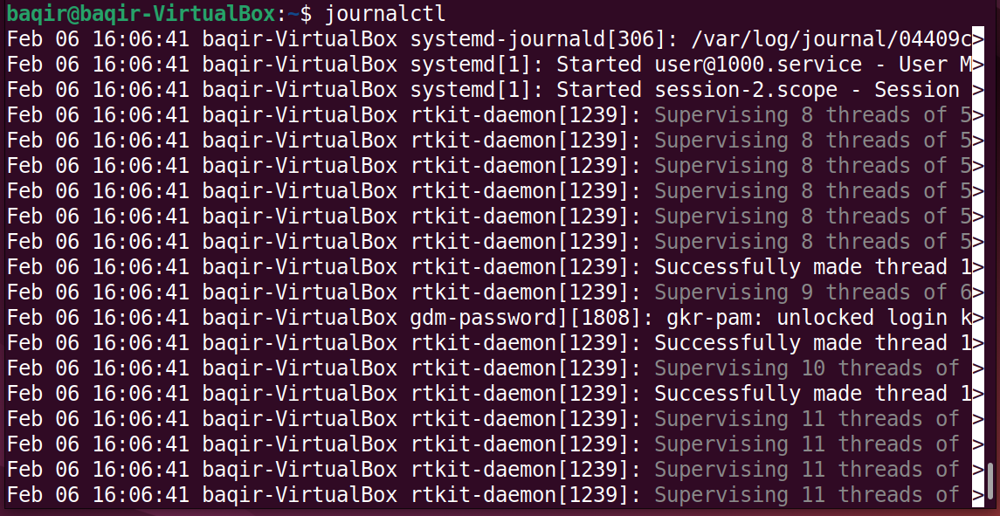
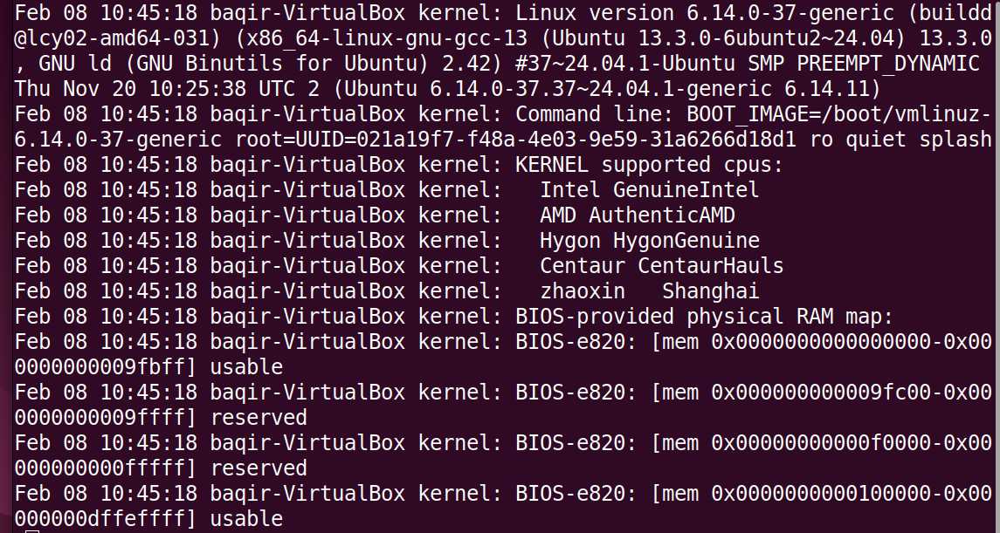
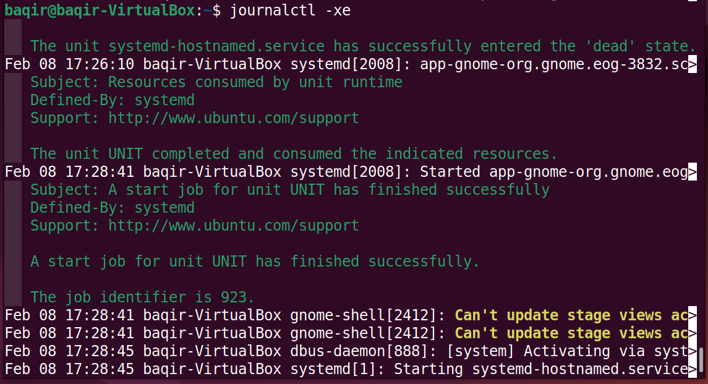
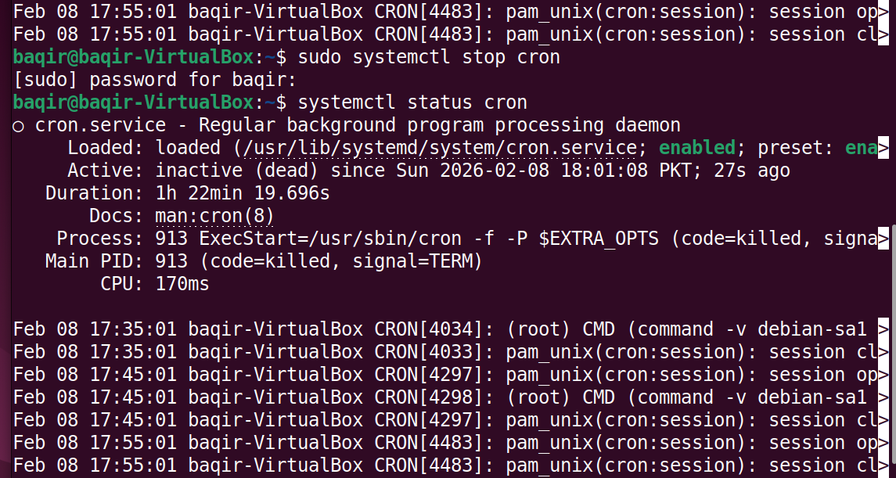
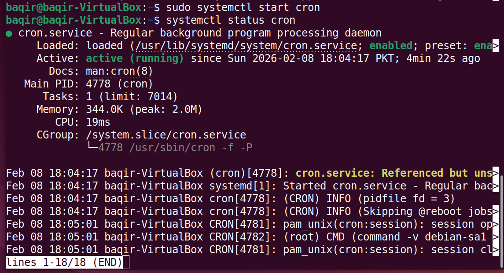

# Day 8 – File Search, Text Processing & System Logs (Linux)

This day focuses on practical Linux skills used daily by DevOps engineers:
- Searching files and directories
- Understanding system logs
- Managing services using `systemctl`
- Working with `journalctl`

---

## Topics Covered
- `find` command (by name, type, size)
- System logs with `journalctl`
- Service status using `systemctl`
- Managing `cron` service

---

## Step 1: Find files by name

**Command:**
```bash
find . -name "*.png"
Explanation:
Searches recursively for files ending with .png
**Screenshots**

##Step 2: Find files and directories by type
Find only directories

Bash
find . -type d
**Screenshots  (Directories)**


Find only files

Bash
find . -type f
**Screenshots (Files)

##Step 3: Find files by size
Command:

Bash
find . -size +1M
Explanation:
Finds files larger than 1 MB
**Screenshot**

##Step 4: Viewing system logs using journalctl
View all logs

Bash
journalctl
**Screenshot**


View logs from today

Bash
journalctl --since today
**Screenshot**


View error logs only

Bash
journalctl -p err
**Screenshot**


View last 20 logs of a specific service

Bash
journalctl -u systemd-hostnamed -n 20
**Screenshot**


Stop cron service

Bash
sudo systemctl stop cron
**Screenshot**


Start cron service

Bash
sudo systemctl start cron
**Screenshot**

Key Learnings
● find is a powerful tool for file and directory search

● journalctl helps debug system and service issues

● systemctl is essential for managing Linux services

● Understanding logs is critical for DevOps and production troubleshooting 


Day 8 Status
✅ Completed
📁 Screenshots organized
📘 README documented
