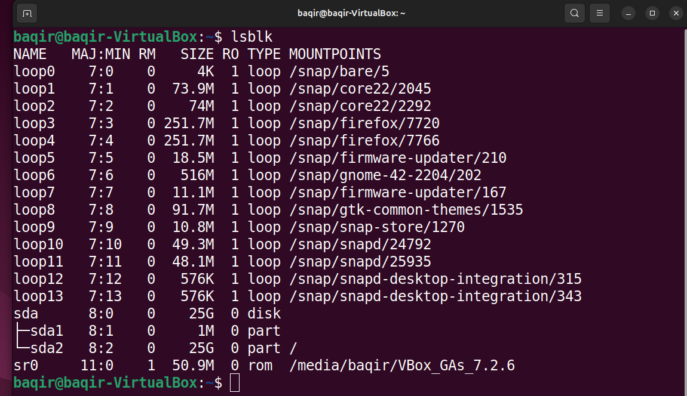
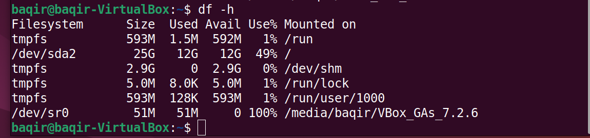
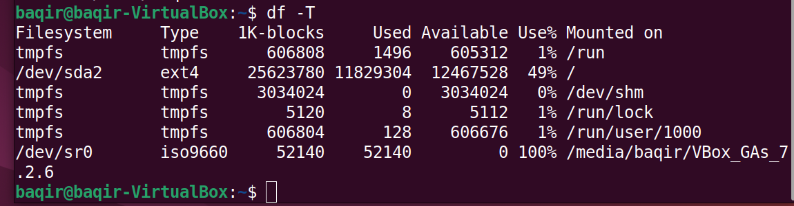
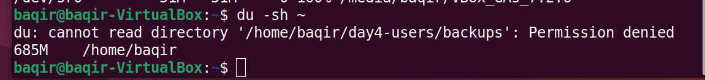
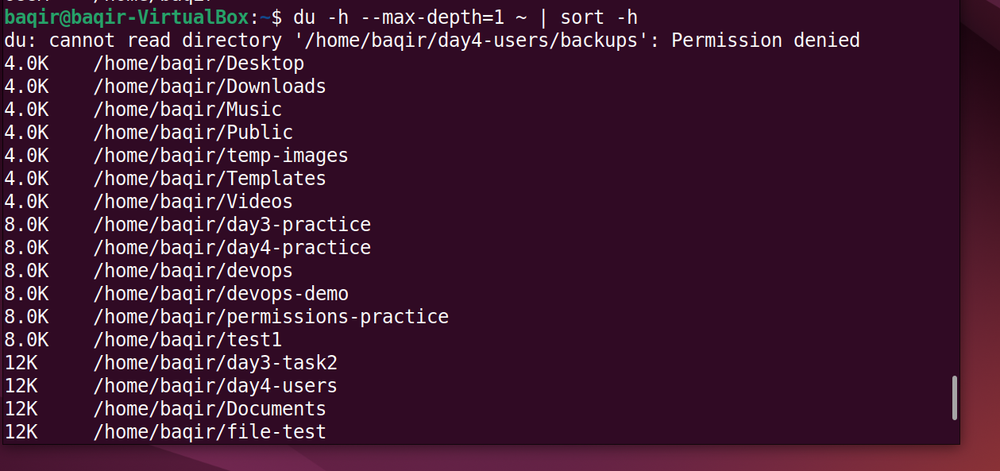
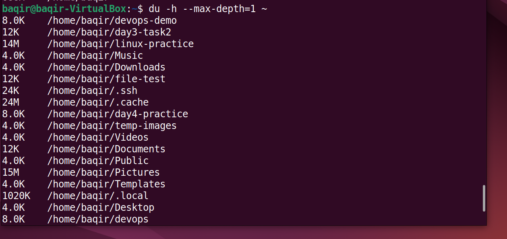
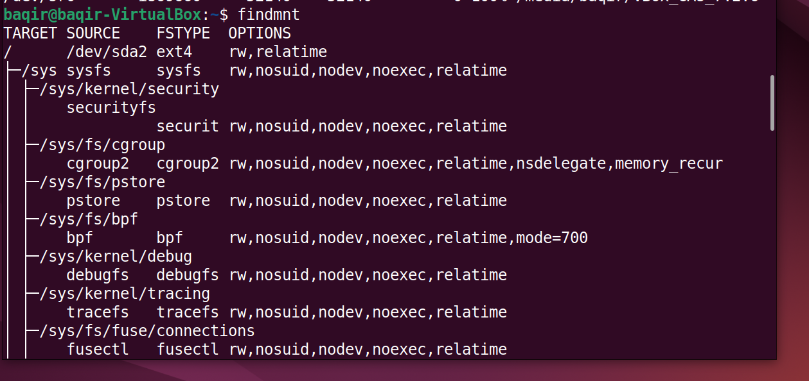
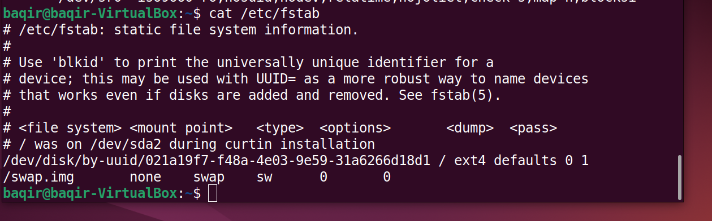

## 📀 Day 9 – Disk & File System (Linux)

## 🎯 Objective
Understand how Linux manages disks, partitions, filesystems, mounts, and disk usage — essential for DevOps and production servers.

## 📚 Topics Covered
•Block devices and partitions
•Disk usage analysis
•Mounted filesystems
•Persistent mounts (/etc/fstab)
•Finding mount points

## 🔹 Step 1: List block devices

**Command**:

```Bash
lsblk
```
## Explanation:
Displays all block devices, partitions, and mount points.

**Screenshot**



## 🔹 Step 2: Check disk space usage

a) Human readable disk usage

**Command**

```Bash
df -h
```
## Explanation:
Shows disk size, used space, available space, and mount points.

**Screenshot**



b) Filesystem type
**Command**

```Bash
df -T
```
## Explanation:
Displays filesystem types (ext4, tmpfs, etc.).

**Screenshot**



## 🔹 Step 3: Check total home directory size

**command**

```Bash
du -sh ~
```
## Explanation:
Shows total disk usage of the home directory.

**Screenshot**



## 🔹 Step 4: Find large directories (sorted)

**Command**

```Bash
du -h --max-depth=1 ~ | sort -h
```
## Explanation:
Helps identify large directories consuming disk space.

**Screenshot**



## 🔹 Step 5: Check subdirectory sizes

**Command**

```Bash
du -sh *
```
## Explanation:
Displays size of each directory in the current folder.

**Screenshot**



## 🔹 Step 6: Find mount points

**Command**

```Bash
findmnt
```
## Explanation:
Shows mounted filesystems and hierarchy.

**Screenshot**



## 🔹 Step 7: Persistent mounts configuration

**Command**

```Bash
cat /etc/fstab
```
## Explanation:
Lists filesystems mounted automatically at boot.

**Screenshot**



## 🧠 Key Learnings

•lsblk → disk & partition layout
•df → filesystem usage
•du → directory usage
•findmnt → mount hierarchy
•/etc/fstab → permanent mounts

## ✅ Day 9 Status

✔ Commands practiced
✔ Screenshots captured
✔ README documented
✔ Git-ready structure
